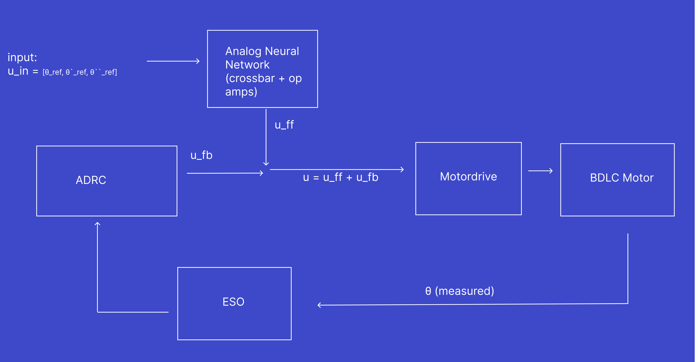
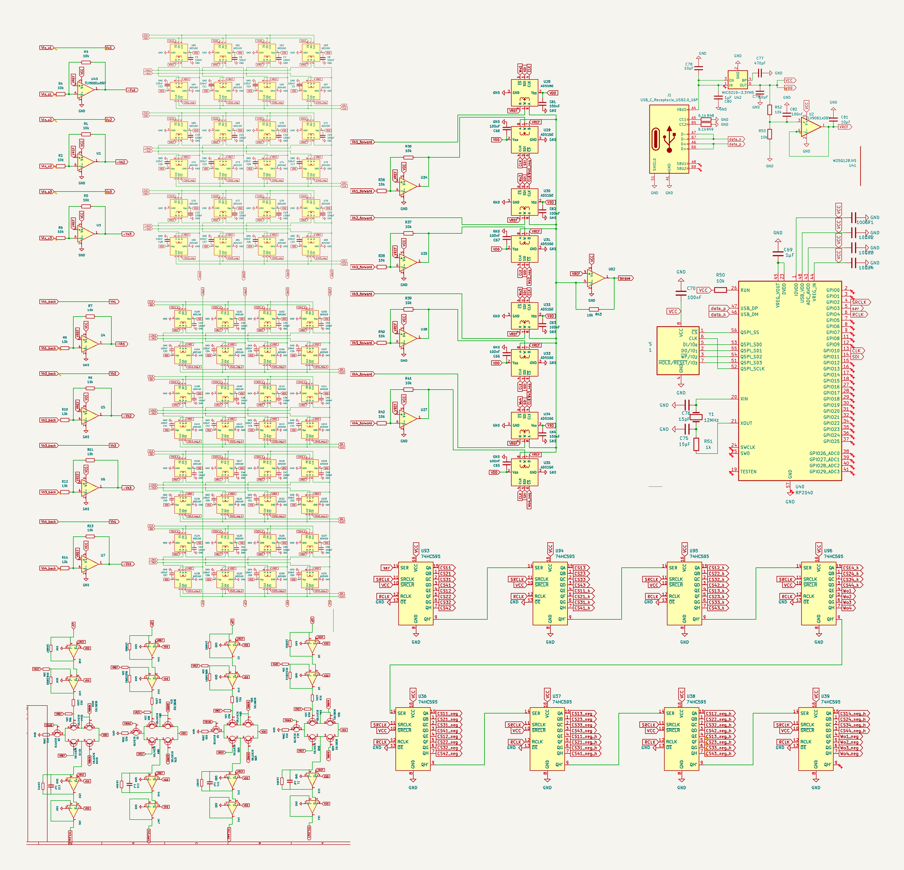
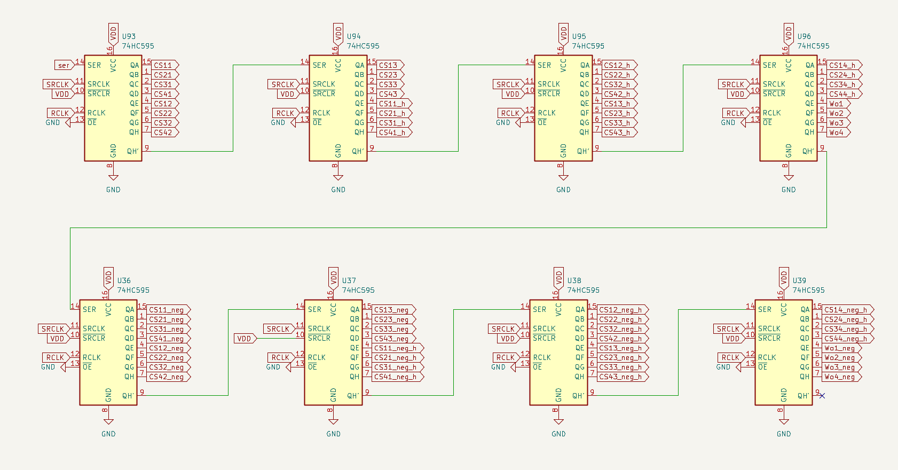
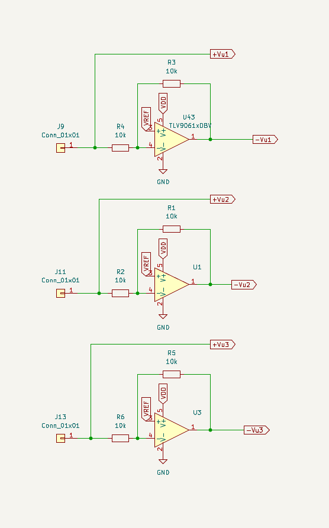
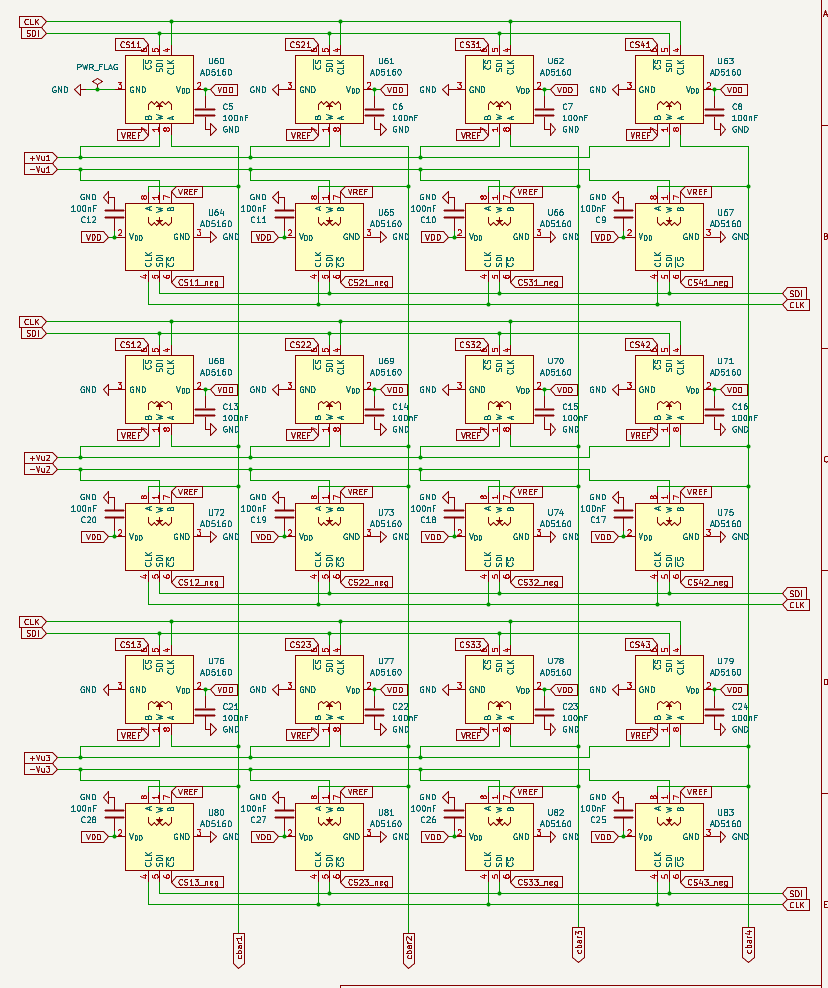
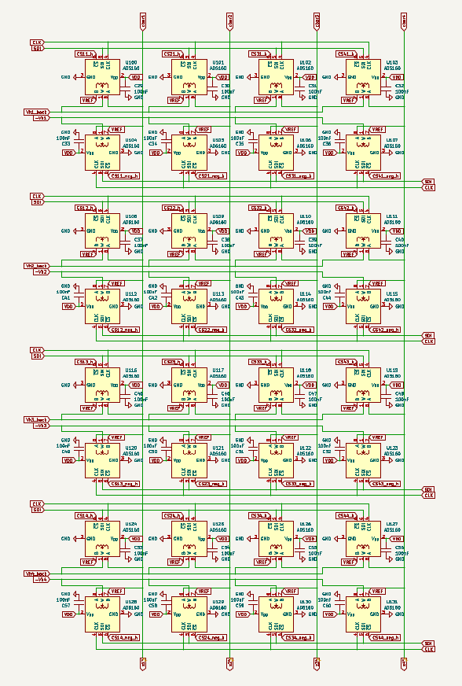
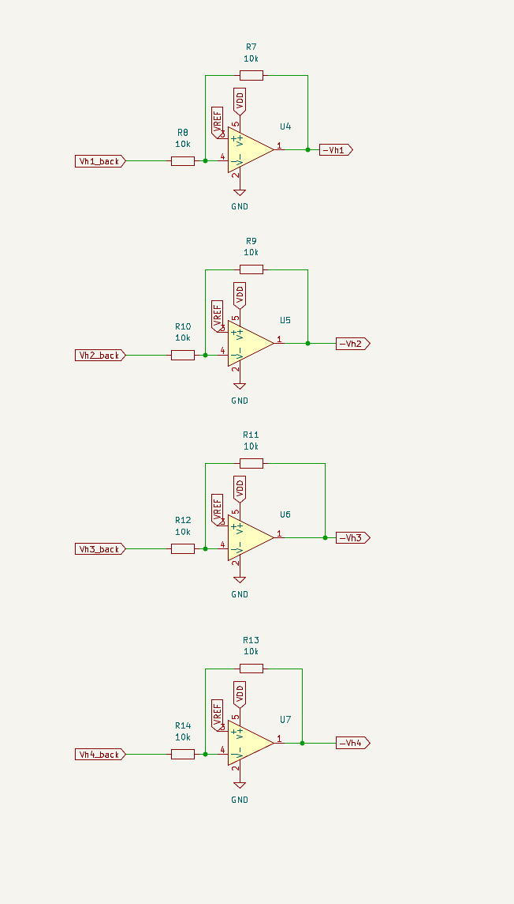
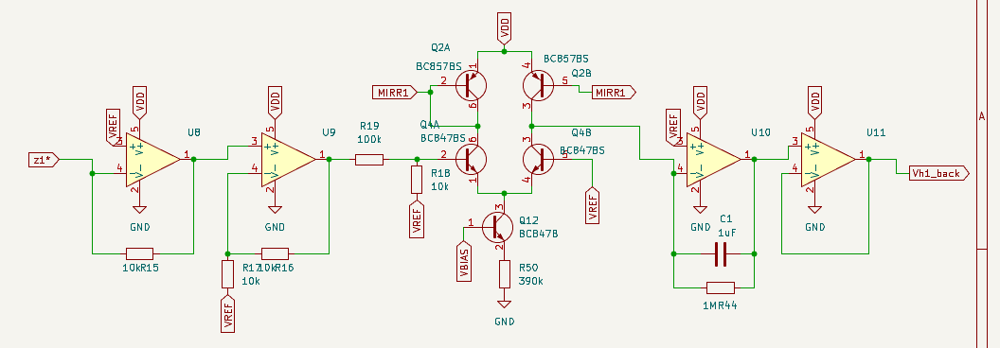
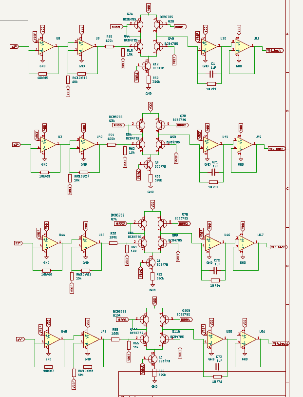
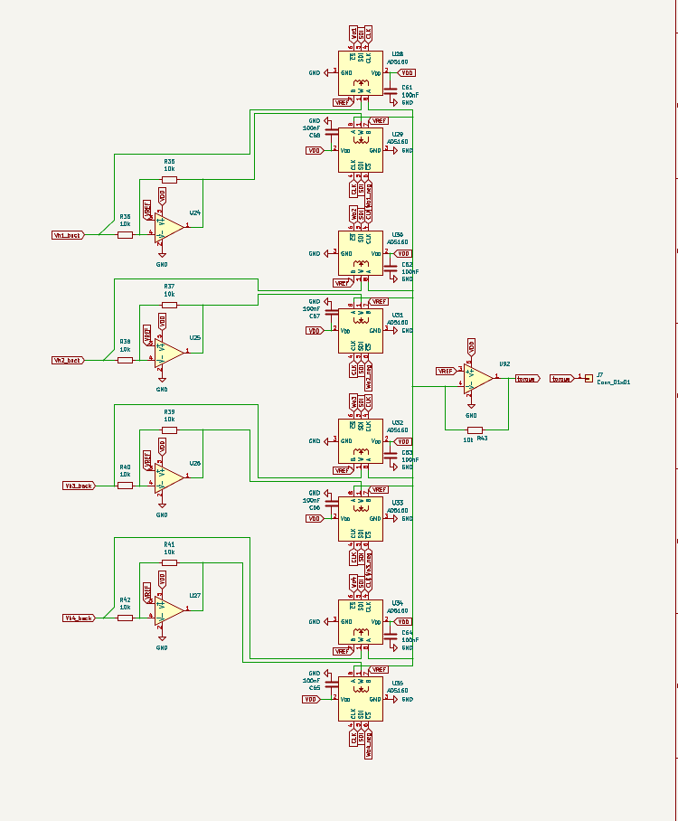

## Introduction and Motivation

One small size Satellites like CubeSat, performance in control tasks such as Earth observation, optical downlink, and formation flying depend on precise and accurate pointing. In CubeSat Specifically, the performance of these pointing tasks are limited by power and thermal budget constraints. Power generation on these small platforms is constrained by the limited surface area available for solar cells (Weston et al., 2025).

Heat produced in vacuum is very difficult for small spacecrafts that only weigh a few kilograms when the only path for heat dissipation is through radiation. NASA's small-spacecraft thermal energy balance shows this clearly: $q_{\text{solar}} + q_{\text{albedo}} + q_{\text{planetshine}} + Q_{\text{gen}} = Q_{\text{stored}} + Q_{\text{out,rad}}$, the only outbound path is $Q_{\text{out,rad}}$, heat emitted via radiation, and its magnitude depends on "the surface area designated as radiator space" (Weston et al., 2025, ch. 7). This becomes a problem when Radiation-hardened digital processors capable of running high-bandwidth model-based control (H-infinity, LQR, or model predictive control) draw watts of power. On a spacecraft measured in units of 10 cm, that area is small. Some common solutions to this Size, Weight, and Power (SWaP) bottleneck is using lightweight PID controllers that run at only tens to hundreds of hertz. This leaves precision and control performance on the table.

In advanced and thermally expensive controllers, the main computational expense comes from the nonlinear inverse-dynamics computations. My proposed solution is to offload this to a feedforward analog neural network that computes it as continuous time, current mode operations through analog in-memory computing. This process allows the multiply-accumulate to be performed by the physics of an array of resistors rather than by arithmetic instructions (Mannocci et al., 2026). This open-loop system is then closed with a digital Active Disturbance Rejection Controller (ADRC) and its Extended State Observer (ESO), which is cheap enough to run on the microcontroller a CubeSat already carries (Han, 2009, as cited in Herbst, 2013). The main question this experiment answers is whether a mixed-signal control architecture (learned analog feedforward path then closed by a digital ADRC loop) can deliver high precision and robust attitude control while keeping within the power and thermal budgets of CubeSat sized satellites, without measuring the spacecraft's dynamics in advance.

To answer this, five controllers will be compared: a tuned digital PID, representing the low-power controller a CubeSat runs today; the analog neural network alone, run open-loop to show that feedforward without any feedback drifts off and cannot stand on its own as a controller; the analog neural network closed with a simple digital PID, which isolates how much the feedforward alone contributes with a conventional feedback loop; the proposed analog neural network closed with digital ADRC; and an idealized digital ADRC handed the exact plant model, included as a best-case upper bound. Comparing PID to NN + PID isolates the benefit of the analog feedforward, while comparing NN + PID to NN + ADRC isolates the benefit the ESO adds on top.

## The SWaP Bottleneck

- Power and Heat: Advanced digital controllers need watts of compute. Because a CubeSat's thermal path in a vacuum is only through radiation, heat is very expensive to dissipate, and the radiating area available scales with a body measured in units of 10 cm (Weston et al., 2025, ch. 7).
- Loop Rate: a low power processor running a PID controller at tens to low hundred of Hertz, caps how fast disturbances can be rejected.
- Model Fragility: Model based controls degrade when parameters drift and do not perform with less precise models. ADRC maintains robustness even against unmodeled dynamics and external disturbances; because it lumps all modeling error into one estimated signal, only a very coarse process model is needed to design the loop (Herbst, 2013).

## General Setup Overview

  

*The complete board. Reading left to right: the three input channels and their inverters, the two potentiometer crossbars ($W_{ih}$ above, $W_{hh}$ below), the four $\sigma$ blocks and integrators along the bottom, the output weight stage and torque summing amplifier in the center, and on the right the RP2040, its flash and USB-C interface, and the eight 74HC595 shift registers that carry weight code words to all 64 potentiometers.*

*The weight-loading path. Eight 74HC595 registers are daisy-chained through `QH'` into `SER`, giving 64 outputs from three microcontroller pins (`ser`, `SRCLK`, `RCLK`). The top row addresses the positive leg of each signed weight pair and the bottom row the negative leg; `RCLK` is common to all eight, so every weight on the board updates on the same edge rather than rippling in one at a time.*

## Input

The feedforward network is driven by the commanded trajectory and not by the measured state. The guidance layer, at every instant, produces a reference angle, reference angular velocity, and reference angular acceleration for the axis being controlled:

$$

u(t) =

\begin{bmatrix} u_1(t) \\ u_2(t) \\ u_3(t) \end{bmatrix}

=

\begin{bmatrix} \theta_{\text{ref}}(t) \\ \dot{\theta}_{\text{ref}}(t) \\ \ddot{\theta}_{\text{ref}}(t) \end{bmatrix}

\in \mathbb{R}^{3}

$$
Each component is carried as a voltage referenced to the mid-supply rail `VREF`, so a signed quantity maps onto a single-supply node (Vref = VDD/2). This is the standard single supply technique: "a source of 'half-supply' creates a 'virtual ground' exactly half way between the positive supply and ground potentials" (Carter & Brown, n.d.):

$$

V_{u_i} = V_{\text{REF}} + k_i\, u_i, \qquad i = 1,2,3

$$

  where $k_i$ converts a physical quantity into volts. Each  $k_i$ value is chosen so that the largest value the channel ever becomes lands within the bounds of `VREF` which is $\pm 1.65$ V; a bound the electronics of this board can go before clipping occurs.

*The three input channels. Each connector (`J9`, `J11`, `J13`) drives a unity-gain inverting amplifier referenced to `VREF`, producing the negated rail that the signed weight pairs of Stage 1 need: `+Vu1` is taken straight from the connector and `-Vu1` comes from `U43`, with $R_3 = R_4 = 10\ \text{k}\Omega$ setting a gain of exactly $-1$ about `VREF`.*

## Analog Neural Network

The network is a continuous-time recurrent neural network (CTRNN) with three inputs, four hidden states, and one torque output. It functions to approximate the nonlinear inverse dynamics $\tau_{\text{ff}} = f^{-1}(u)$, the torque that would give you the trajectory on the spacecraft. 

$$

u \in \mathbb{R}^{3}, \qquad h \in \mathbb{R}^{4}, \qquad \tau_{\text{ff}} \in \mathbb{R}

$$
### Stage 1 Input Projection

The input vector is projected onto the four hidden channels by the input weight matrix $W_{ih} \in \mathbb{R}^{4 \times 3}$. This is physically represented by the `crossbar_u` sheet: twelve weights, one per intersection of an input column and a hidden row.

$$

W_{ih}\,u =

\begin{bmatrix}

w^{ih}_{11} & w^{ih}_{12} & w^{ih}_{13} \\

w^{ih}_{21} & w^{ih}_{22} & w^{ih}_{23} \\

w^{ih}_{31} & w^{ih}_{32} & w^{ih}_{33} \\

w^{ih}_{41} & w^{ih}_{42} & w^{ih}_{43}

\end{bmatrix}

\begin{bmatrix} u_1 \\ u_2 \\ u_3 \end{bmatrix}

=

\begin{bmatrix}

w^{ih}_{11}u_1 + w^{ih}_{12}u_2 + w^{ih}_{13}u_3 \\

w^{ih}_{21}u_1 + w^{ih}_{22}u_2 + w^{ih}_{23}u_3 \\

w^{ih}_{31}u_1 + w^{ih}_{32}u_2 + w^{ih}_{33}u_3 \\

w^{ih}_{41}u_1 + w^{ih}_{42}u_2 + w^{ih}_{43}u_3

\end{bmatrix}

\in \mathbb{R}^{4}

$$

Vector multiplication is performed through Ohm's law and the sum is Kirchhoff's current law: each weight sets a conductance $G^{ih}_{ji}$, the input voltage across it produces a current $I_{ji} = G^{ih}_{ji} V_{u_i}$, and the currents landing on the same virtual-ground summing node add themselves. A $4 \times 3$ matrix–vector product costs no clock cycles and no multiplier: it happens at the speed of the wire. This is the defining property of analog in-memory computing, in which Ohm's and Kirchhoff's laws act as "physical surrogates of multiply-accumulate operations" in a crossbar array rather than the operation being performed by arithmetic hardware (Mannocci et al., 2026).

  

  

*The `crossbar_u` sheet, $W_{ih}$. Three input rows run horizontally, each carrying both polarities (`+Vu1`/`-Vu1` and so on); four columns descend to the summing nodes `cbar1`…`cbar4`. Every intersection holds two AD5160 potentiometers (one tapping the positive rail, one the negative) so the twelve weights of $W_{ih}$ occupy twenty-four parts, `U60` through `U83`. Their chip-select lines (`CS11`, `CS11_neg`, …) come from the shift-register chain.*

  

A potentiometer conductance is strictly positive, so a signed weight is built from two paths driven by equal and opposite voltages. Every signal exists on the board in both polarities about `VREF`.

  

$$

I = G^{+}(V - V_{\text{REF}}) + G^{-}\big({-}(V - V_{\text{REF}})\big) = (G^{+} - G^{-})(V - V_{\text{REF}})

$$

  

giving a weight of either sign from strictly positive conductances:

  

$$

w = \alpha\,(G^{+} - G^{-}), \qquad G^{\pm} \ge 0

$$

  

Each conductance is set by an AD5160 8-bit digital potentiometer and loaded over the `SDI`/`CLK` shift-register chain. The part is available with end-to-end resistances of 5 kΩ, 10 kΩ, 50 kΩ, and 100 kΩ; this board uses the 10 kΩ variant (Analog Devices, n.d.).

### Stage 2 Recurrent Projection

The hidden state is fed back on itself through $W_{hh} \in \mathbb{R}^{4 \times 4}$ (the `crossbar_h` sheet, sixteen weights, driven by the `Vh1_back` … `Vh4_back` return nets). This is what gives the network memory: the output depends on the history of the command, not just its current value. The recurrent weight matrix is what makes the network a dynamical system.

*The `crossbar_h` sheet, $W_{hh}$. Same construction as the input crossbar but square: four rows of returning hidden states against the four summing nodes, thirty-two potentiometers (`U100`–`U131`) for sixteen signed weights. Every row reaches every column, which is what allows the off-diagonal coupling that lets units oscillate and lead rather than behaving as four independent filters.*

$$

W_{hh}\,h =

\begin{bmatrix}

w^{hh}_{11} & w^{hh}_{12} & w^{hh}_{13} & w^{hh}_{14} \\

w^{hh}_{21} & w^{hh}_{22} & w^{hh}_{23} & w^{hh}_{24} \\

w^{hh}_{31} & w^{hh}_{32} & w^{hh}_{33} & w^{hh}_{34} \\

w^{hh}_{41} & w^{hh}_{42} & w^{hh}_{43} & w^{hh}_{44}

\end{bmatrix}

\begin{bmatrix} h_1 \\ h_2 \\ h_3 \\ h_4 \end{bmatrix}

=

\begin{bmatrix}

w^{hh}_{11}h_1 + w^{hh}_{12}h_2 + w^{hh}_{13}h_3 + w^{hh}_{14}h_4 \\

w^{hh}_{21}h_1 + w^{hh}_{22}h_2 + w^{hh}_{23}h_3 + w^{hh}_{24}h_4 \\

w^{hh}_{31}h_1 + w^{hh}_{32}h_2 + w^{hh}_{33}h_3 + w^{hh}_{34}h_4 \\

w^{hh}_{41}h_1 + w^{hh}_{42}h_2 + w^{hh}_{43}h_3 + w^{hh}_{44}h_4

\end{bmatrix}

\in \mathbb{R}^{4}

$$

*The negated hidden-state rails. Each buffered state `Vh1_back`…`Vh4_back` passes through a unity-gain inverter about `VREF` (`U4`–`U7`, 10 k$\Omega$ pairs) to produce `-Vh1`…`-Vh4`. These four amplifiers are what make the recurrent weights signed: without an inverted copy of each state, every entry of $W_{hh}$ could only ever be positive, since a potentiometer's conductance cannot be.*

### Stage 3 Pre-activation

Both crossbars discharge into the same summing node, so the two products add before the nonlinearity:

  

$$

z = W_{ih}\,u + W_{hh}\,h

$$

  

$$

\begin{bmatrix} z_1 \\ z_2 \\ z_3 \\ z_4 \end{bmatrix}

=

\begin{bmatrix}

\sum_{i=1}^{3} w^{ih}_{1i}u_i + \sum_{k=1}^{4} w^{hh}_{1k}h_k \\

\sum_{i=1}^{3} w^{ih}_{2i}u_i + \sum_{k=1}^{4} w^{hh}_{2k}h_k \\

\sum_{i=1}^{3} w^{ih}_{3i}u_i + \sum_{k=1}^{4} w^{hh}_{3k}h_k \\

\sum_{i=1}^{3} w^{ih}_{4i}u_i + \sum_{k=1}^{4} w^{hh}_{4k}h_k

\end{bmatrix}

$$

  

There is no bias term, and the part count is what rules one out. The board carries 64 potentiometers, which is exactly $2 \times (12 + 16 + 4)$: twelve weights in $W_{ih}$, sixteen in $W_{hh}$, four in $W_o$ and each requiring a *pair* of pots, since a conductance is strictly positive and a signed weight has to be built as the difference of two of them.

There is no bias term because a bias would be a constant current pushed into the summing node regardless of the command, so the network would ask for some fixed torque even when the guidance layer had commanded nothing. Here $z = 0$ at zero command, $\sigma(0) = 0$, every hidden state settles to zero, and the readout $W_o h$ goes to zero with it: idle is idle.

Physically, the sum is performed by a transimpedance amplifier per row (`U8`, `U2`, `U44`, `U48`), whose inverting input is the crossbar node held at `VREF` and whose feedback resistor is 10 k$\Omega$ (`R15`, `R53`, `R60`, `R67`). Because of the amplifier's high gain, only a very small voltage appears across its inputs, so the inverting node "can be assumed to be ground — a 'virtual ground'" (Carter & Brown, n.d.). That is what makes the summing exact: negative feedback holds the node at a fixed potential regardless of how much current arrives, so the individual crossbar currents do not interact and none of them modulates the voltage the others see. The four pre-activations appear on the schematic as the nets `z1*`, `z2*`, `z3*`, `z4*`; the asterisk records that these are the *inverted* sums, since a transimpedance stage inverts. The sign is restored by the inverting integrator of Stage 5.

Each row's transimpedance output is then scaled by a non-inverting stage of gain $1 + R_{16}/R_{17} = 2$ (`U9`, `U40`, `U45`, `U49`) before reaching the nonlinearity. It is there because one resistor cannot both keep `U8` inside its supply limit and deliver enough voltage to saturate the $\sigma$ block. Made large, $R_{15}$ hands the $\sigma$ block plenty of signal but lets `U8` slam into its rail on ordinary crossbar currents; made small, it keeps `U8` safe but leaves the $\sigma$ block short of saturation. Doubling the voltage afterwards lets $R_{15}$ stay small while the $\sigma$ block still gets the signal it needs.

### Stage 4 Nonlinearity

In the trained model each pre-activation passes through a saturating, odd, monotone squashing function:

$$

\sigma(z) =

\begin{bmatrix} \sigma(z_1) \\ \sigma(z_2) \\ \sigma(z_3) \\ \sigma(z_4) \end{bmatrix}

=

\begin{bmatrix} \tanh(z_1) \\ \tanh(z_2) \\ \tanh(z_3) \\ \tanh(z_4) \end{bmatrix}

\in (-1, 1)^{4}

$$
$$

\tanh(z) = \frac{e^{z} - e^{-z}}{e^{z} + e^{-z}}, \qquad

\frac{d}{dz}\tanh(z) = 1 - \tanh^{2}(z)

$$
$\tanh$ was used because it is zero-centered and odd, $\sigma(-z) = -\sigma(z)$, which matches a torque command that must be symmetric about zero for clockwise and counter-clockwise rotation. It also saturates, which is the safety property that matters in flight: however large the commanded input, $|\sigma(z_j)| < 1$ bounds every hidden state through Stage 5, and therefore bounds the feedforward torque the network can ever ask for. The neurons in the earliest networks of this family were strictly on or off. Hopfield (1984) showed that replacing them with continuous ones, whose output follows a smooth S-shaped curve of their input as shown here on this board, leaves the network's collective behavior essentially unchanged, and that a network of this kind can be built directly from ordinary amplifiers and resistors.

The nonlinearity is also what makes this a neural network rather than a filter. Stages 1, 2, 3, 5, and 6 are all linear maps, and a composition of linear maps is linear; without $\sigma$ the entire block collapses to a transfer function and cannot approximate a nonlinear inverse-dynamics map at all.

*One complete hidden unit, left to right: `U8` converts the crossbar's summed current into the pre-activation `z1*`; `U9` scales it by two; `R19` and the 10 k$\Omega$ shunt attenuate that swing by $1/11$ to reach the differential pair `Q4A`/`Q4B`; the `Q2A`/`Q2B` mirror above returns the pair's output as a signed current; `Q12` and `R50` set the tail current from `VBIAS`; and the result is delivered into `U10`'s summing node, where `C1` and `R44` form the leaky integrator whose output `U11` buffers back out as `Vh1_back`. Note that the pair's collectors connect directly to the integrator input, there is no resistor between the $\sigma$ block and the integrator.*

### Stage 5 Integration

The nonlinearity is proportional to the *derivative* of the hidden state, not the state itself, which is what makes the network continuous-time rather than a clocked layer. In the idealized CTRNN this is a pure integration:
$$

\dot{h} = \sigma(z), \qquad h(t) = h(0) + \int_{0}^{t} \sigma\big(z(s)\big)\,ds

$$

*All four hidden units on the `op_amps` sheet, one per row and identical apart from designators. The integrators are visible at the right of each row as a 1 µF capacitor in parallel with a 1 M$\Omega$ resistor, the parallel pair is what makes the integration leaky, and their product sets $\tau_h = 1$ s. The four `VBIAS` labels all reach the same divider, so a single bias network sets the tail current, and therefore the activation amplitude, for every unit at once.*

Each hidden unit has one op-amp integrator (`U10`, `U41`, `U46`, `U50`) with two parts around it: a feedback capacitor $C = 1\ \mu\text{F}$ (`C1`, `C71`, `C72`, `C73`) and a feedback resistor $R_f = 1\ \text{M}\Omega$ (`R44`, `R57`, `R64`, `R71`) placed **in parallel with the capacitor**. The $\sigma$ block of Stage 4 delivers a *current* into the summing node, so the integrator acts as a transresistance.

At the virtual-ground node three currents meet and must cancel: the current arriving from the $\sigma$ block, the current leaking out through $R_f$, and the current charging $C$. Writing $h_j$ for the integrator output measured from `VREF`,
$$

I_{\sigma} \;+\; \frac{h_j}{R_f} \;+\; C\,\frac{dh_j}{dt} \;=\; 0

$$
Multiplying through by $R_f$ puts this in standard first-order form:
$$

R_f C\,\frac{dh_j}{dt} \;=\; -\,h_j \;-\; R_f\,I_{\sigma}

$$
The minus sign left on $R_f I_{\sigma}$ cancels against the inversion the `z1*`…`z4*` nets already carry from Stage 3. Substituting $I_{\sigma} = I_{\text{tail}}\,\sigma(z_j)$ then gives the standard leaky CTRNN state equation, the same first-order form used in continuous analog networks of graded-response units (Hopfield, 1984):
$$

\boxed{\;\tau_h\,\dot{h}_j = -\,h_j + G\,\sigma(z_j)\;},

\qquad

\tau_h = R_f C = 1.0\ \text{s},

\qquad

G \equiv R_f\,I_{\text{tail}} = 1.57\ \text{V}

$$
At every instant the state $h_j$ is heading toward the value $G\,\sigma(z_j)$, and $\tau_h$ sets how quickly it closes the gap. With $\tau_h = 1$ second, a unit takes a few seconds to respond fully, and what it holds at any moment reflects roughly the last second of its input.

The two constants do different jobs. $R_f$ converts the activation current into a voltage (1 M$\Omega$ means one microamp of $I_{\sigma}$ produces one volt of $h_j$). The $\sigma$ block's output can never exceed $I_{\text{tail}} = 1.57\ \mu$A, so the state can never exceed $G = R_f I_{\text{tail}} = 1.57$ V. No command can push a hidden state past 1.57 V, which sits just inside the $\pm 1.65$ V supply. Since Stage 6 builds the torque command out of these states, it bounds the torque the network can ask for as well.

The leak resistor is what makes the state usable over a long mission. Real transistors are never perfectly matched, and in the $\sigma$ block that mismatch leaves a small error current flowing even when the input is zero. An integrator with no leak accumulates that error forever.

Each $h_j$ is buffered by `U11`, `U42`, `U47`, `U51` and returned to `crossbar_h` as `Vh1_back`…`Vh4_back`.

### Stage 6 Output

The four hidden states are collapsed into a single feedforward torque by the output weight row vector $W_o \in \mathbb{R}^{1 \times 4}$: the `torque` sheet, where `Wo1`…`Wo4` set the summing-amplifier gains and the result leaves on the `torque` net:

$$

\tau_{\text{ff}} = W_o\,h =

\begin{bmatrix} w^{o}_{1} & w^{o}_{2} & w^{o}_{3} & w^{o}_{4} \end{bmatrix}

\begin{bmatrix} h_1 \\ h_2 \\ h_3 \\ h_4 \end{bmatrix}

= w^{o}_{1}h_1 + w^{o}_{2}h_2 + w^{o}_{3}h_3 + w^{o}_{4}h_4

$$

  

*The `torque` sheet, $W_o$. On the left, `U24`–`U27` invert the four hidden states to give each output weight its negative rail; the eight potentiometers `U28`–`U35` form the four signed pairs, and all of their outputs land on one summing node at `U92`, whose 10 k$\Omega$ feedback resistor `R43` converts the total current back into the single `torque` voltage leaving on `J7`. A row vector of four weights collapses to a single amplifier.*

### Final formulation

Collecting the six stages, the whole analog block is two lines:

$$

\boxed{\;

\tau_h\,\dot{h} = -\,h + G\,\sigma\big(W_{ih}\,u + W_{hh}\,h\big)

\;}

$$
$$

\boxed{\;\tau_{\text{ff}} = W_o\,h\;}

$$

Fully expanded, with $u = [\theta_{\text{ref}}, \dot{\theta}_{\text{ref}}, \ddot{\theta}_{\text{ref}}]^{\mathsf{T}}$ and $\sigma$ applied element wise:

$$

\tau_h

\begin{bmatrix} \dot{h}_1 \\ \dot{h}_2 \\ \dot{h}_3 \\ \dot{h}_4 \end{bmatrix}

=

-\begin{bmatrix} h_1 \\ h_2 \\ h_3 \\ h_4 \end{bmatrix}

+ G\,\sigma\!\left(

\begin{bmatrix}

w^{ih}_{11} & w^{ih}_{12} & w^{ih}_{13} \\

w^{ih}_{21} & w^{ih}_{22} & w^{ih}_{23} \\

w^{ih}_{31} & w^{ih}_{32} & w^{ih}_{33} \\

w^{ih}_{41} & w^{ih}_{42} & w^{ih}_{43}

\end{bmatrix}

\begin{bmatrix} \theta_{\text{ref}} \\ \dot{\theta}_{\text{ref}} \\ \ddot{\theta}_{\text{ref}} \end{bmatrix}

+

\begin{bmatrix}

w^{hh}_{11} & w^{hh}_{12} & w^{hh}_{13} & w^{hh}_{14} \\

w^{hh}_{21} & w^{hh}_{22} & w^{hh}_{23} & w^{hh}_{24} \\

w^{hh}_{31} & w^{hh}_{32} & w^{hh}_{33} & w^{hh}_{34} \\

w^{hh}_{41} & w^{hh}_{42} & w^{hh}_{43} & w^{hh}_{44}

\end{bmatrix}

\begin{bmatrix} h_1 \\ h_2 \\ h_3 \\ h_4 \end{bmatrix}

\right)

$$

$$

\tau_{\text{ff}} =

\begin{bmatrix} w^{o}_{1} & w^{o}_{2} & w^{o}_{3} & w^{o}_{4} \end{bmatrix}

\begin{bmatrix} h_1 \\ h_2 \\ h_3 \\ h_4 \end{bmatrix}

$$
There are **32 trainable parameters**: 12 in $W_{ih}$, 16 in $W_{hh}$, and 4 in $W_o$.

These 32 numbers are found offline by gradient descent on a simulated environment, then written into the potentiometer chain. Once loaded, the board holds them statically. This computation runs continuously rather than at a loop rate unlike the digital controller. The digital side never computes $\tau_{\text{ff}}$; it only measures the resulting error and corrects it.

## References

Analog Devices. (n.d.). *AD5160: 256-position SPI-compatible digital potentiometer* [Data sheet]. Retrieved August 12, 2026, from https://www.analog.com/media/en/technical-documentation/data-sheets/AD5160.pdf

Beer, R. D. (2022). The global structure of codimension-2 local bifurcations in continuous-time recurrent neural networks. *Biological Cybernetics, 116*, 501–526. Preprint available at https://arxiv.org/abs/2111.04547

Carter, B., & Brown, T. R. (n.d.). *Handbook of operational amplifier applications* (SBOA092B). Texas Instruments. Retrieved August 12, 2026, from https://www.ti.com/lit/an/sboa092b/sboa092b.pdf

Fortunato, M. (2012). *Temperature and voltage variation of ceramic capacitors, or why your 4.7 µF capacitor becomes a 0.33 µF capacitor* (Tutorial 5527). Maxim Integrated. https://www.analog.com/en/resources/technical-articles/temperature-and-voltage-variation-ceramic-capacitor.html

Gao, Z. (2003). Scaling and bandwidth-parameterization based controller tuning. *Proceedings of the 2003 American Control Conference*, 4989–4996. https://doi.org/10.1109/ACC.2003.1242516 (Open conference-proceedings copy: http://congres.cran.univ-lorraine.fr/2003/ACC%202003/Papers/FP03-3.PDF)

Herbst, G. (2013). A simulative study on active disturbance rejection control (ADRC) as a control tool for practitioners. *Electronics, 2*(3), 246–279. https://doi.org/10.3390/electronics2030246 (Open access; corrected preprint at https://arxiv.org/abs/1908.04596)

Hong, B., & Hajimiri, A. (2017). Analysis of a balanced analog multiplier for an arbitrary number of signed inputs. *International Journal of Circuit Theory and Applications, 45*(4), 483–501. https://doi.org/10.1002/cta.2243 (Author version: https://chic.caltech.edu/wp-content/uploads/2016/08/BHongMultiplierCTA2016-1.pdf)

Hopfield, J. J. (1984). Neurons with graded response have collective computational properties like those of two-state neurons. *Proceedings of the National Academy of Sciences, 81*(10), 3088–3092. https://pmc.ncbi.nlm.nih.gov/articles/PMC345226/

Mannocci, P., Larelli, G., Bonomi, M., & Ielmini, D. (2026). Achieving high precision in analog in-memory computing systems. *npj Unconventional Computing, 3*(1). https://doi.org/10.1038/s44335-025-00044-2

Palermo, S. (2012). *Lecture 20: Bandgap reference* [Lecture notes]. ECEN474: (Analog) VLSI Circuit Design, Analog & Mixed-Signal Center, Texas A&M University. https://people.engr.tamu.edu/spalermo/ecen474/lecture20_ee474_bandgaps.pdf

Trischler, A. P., & D'Eleuterio, G. M. T. (2016). Synthesis of recurrent neural networks for dynamical system simulation. *Neural Networks, 80*, 67–78. https://doi.org/10.1016/j.neunet.2016.04.001 (Open preprint: https://arxiv.org/abs/1512.05702)

University of Michigan. (n.d.). *Introduction: PID controller design.* Control Tutorials for MATLAB and Simulink. Retrieved August 12, 2026, from https://ctms.engin.umich.edu/CTMS/index.php?example=Introduction&section=ControlPID

Weston, S. V., Burkhard, C. D., Stupl, J. M., Ticknor, R. L., Yost, B. D., Austin, R. A., Galchenko, P., Newman, L. K., & Santos Soto, L. (2025). *State-of-the-art small spacecraft technology* (NASA/TP—20250000142). National Aeronautics and Space Administration. https://ntrs.nasa.gov/citations/20250000142

